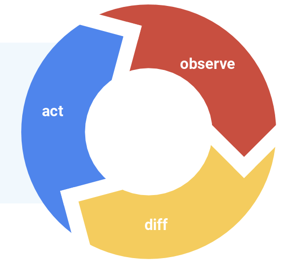
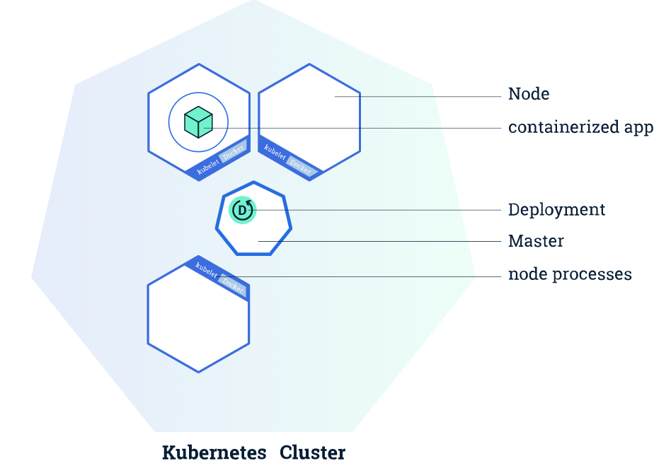

<!-- _class: lead _class: gaia -->
# Intro to Kubernetes


---
# What is it?

Think `docker-compose` on steroids

Formally, it is _container orchestration_.

Automatates for containerized apps ->
* Deployment
* Scaling
* Management

---
# Philosophy

You describe the _Resources_ and _Desired State_ of your application and Kubernetes ensures the app is at that state.



---
# Heroku

Heroku solved this problem in a very explicit manner.


Bill's LYS: https://docs.google.com/presentation/d/12HWJP1UijZ5L5CqC4xav0C0avEd9jS37lmV8Gs2hbuI/

---
# Basic Building Blocks of K8s

`Pod` - smallest unit, represents a running container process
`Node` - worker VM that runs pods
`Master` - "brain" - manages cluster state
`Cluster` - entire system of nodes

 

---
# Minikube

Local Kubernetes playground

Creates cluster

`minikube-setup.sh`

---
# Baby's First Pod

```yaml
apiVersion: v1
kind: Pod
metadata:
  name: my-python-pod
spec: # desired state
  containers:
  - name: my-python-container
    image: python:3.7.4
    command: ['sh', '-c', 'sleep 3600']
```

Creating pod ->

`kubectl apply -f ./pythonpod.yaml`

---

```yaml
# Deployment
apiVersion: apps/v1
kind: Deployment
metadata:
  name: nginx-deployment
spec: # Desired state
  replicas: 3
  selector:
    matchLabels:
      app: nginx
  template: # Pod template
    metadata:
      name: my-nginx-pod
      labels:
        app: nginx
    spec:
        containers:
        - name: my-nginx-container
          image: nginx
          ports:
          - containerPort: 80
```

---

# Services

Logical group of pods.  Think _front-end_ for a set of pod _backends_

```yaml
apiVersion: v1
kind: Service
metadata:
  name: nginx-service
spec:
  selector:
    app: nginx # group together pods that match this selector
  type: NodePort # expose the service on the node's ip address
  ports:
    - protocol: TCP
      port: 80
      targetPort: 80
```

---

# How Do We Use K8s?

#### GKE: Minikube on GCP

#### 3 GKE Environments - DEV, UAT, PROD

#### Helm - Templating + Versioning for K8s config

---

# More on Helm

**Typical Complexities of K8s Config**:

* One configuration for multiple environments
  * 2 replicas on DEV, but 10 replicas in PROD
  * No need for Beat tasks in DEV
  * SSH keys and Vault tokens are different for each environment
  * etc.
* Versioning of configuration
* Rollout/Rollback

---

# Helm Chart

Allows templating using Go template language

Pass in variables for each rollout

Keeps database of configuration so easy rollbacks
