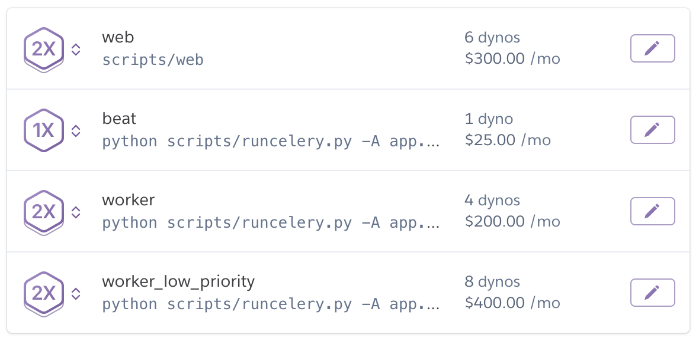

<!-- _class: lead _class: gaia -->
# Intro to Kubernetes

---
# What is it?

Think `docker-compose` on steroids

Formally, it is _container orchestration_.

Automatates for containerized apps ->
* Deployment
* Scaling
* Management

---
# Philosophy

You describe the _Resources_ and _Desired State_ of your application and Kubernetes ensures the app is at that state.

You describe the "what" and Kubernetes figures out the "how".

---
# Heroku

Heroku solved this problem in a very explicit manner.

 

---
# Basic Building Blocks of K8s

...Clusters, Nodes, and Pods

---
# Minikube

...how to setup

---
# Baby's First Pod